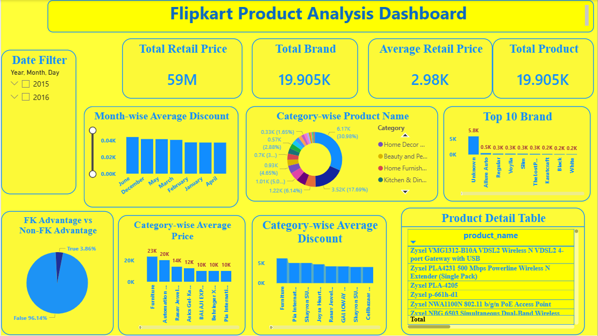

# Flipkart Product Analysis Dashboard

## Project Overview

This project analyzes Flipkart product data to understand pricing, discounts, product categories, and brand performance. The dashboard was built in Power BI using data stored in a MySQL database.

The dataset was downloaded from Kaggle. I first explored the data in Jupyter Notebook using Python and Pandas to understand its structure and verify the data quality. The dataset was already well-organized, so no major data cleaning was required. After that, I imported the data into MySQL, wrote SQL queries for analysis, and connected the database to Power BI to create an interactive dashboard.

## Tools & Technologies

- Python
- Pandas
- Jupyter Notebook
- MySQL
- SQL
- Power BI

## Project Workflow

1. Downloaded the Flipkart dataset from Kaggle.
2. Loaded the dataset into Jupyter Notebook using Pandas.
3. Explored the dataset and checked data quality.
4. Since the dataset was already clean, no significant data cleaning was required.
5. Imported the data into MySQL.
6. Wrote SQL queries for data analysis.
7. Connected MySQL with Power BI.
8. Created an interactive dashboard to visualize product insights.

## Dashboard Highlights

The dashboard provides insights into:

- Total Retail Price
- Average Retail Price
- Total Products
- Total Brands
- Month-wise Average Discount
- Category-wise Product Distribution
- Top 10 Brands
- FK Advantage vs Non-FK Advantage
- Category-wise Average Price
- Category-wise Average Discount
- Product Detail Table
- Interactive Date Filter

## Skills Demonstrated

- Data Exploration using Pandas
- SQL Query Writing
- MySQL Database Management
- Power BI Dashboard Development
- KPI Creation
- Data Visualization
- Business Insight Generation

## Dataset

Source: Kaggle Flipkart Product Dataset

## Dashboard Preview

## Author

**Paswan Shubham Rambadan**

- LinkedIn: https://www.linkedin.com/in/paswanshubham9967
- GitHub: https://github.com/shubhampaswan9967
